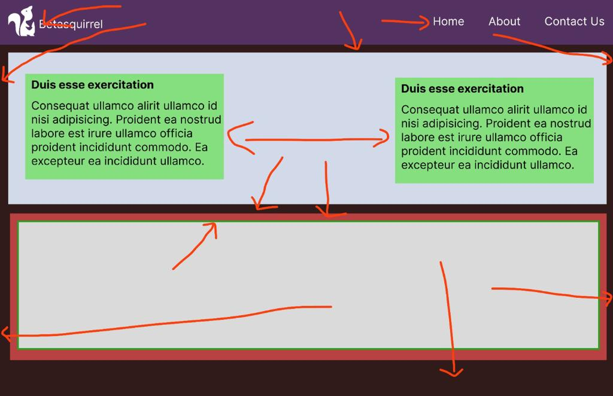

# Tasks

## Links

- [Task Page](https://abdulhakeemkzm.github.io/learning/)
- [Github](https://www.linkedin.com/in/abdulhakeem-kzm-65a27b167)
- [StackOverflow](https://stackoverflow.com/users/21194104/abdul-hakeem-kzm)

## Linux Commands

- `cd` - Change current directory. Eg: `cd Desktop`
- `ls` - List contents of a directory, Eg: `ls -a` lists hidden files as well.
- `pwd` - Display current working directory path
- `cat` - Display contents of a file. Eg: `cat README.md`

## Git Commands

1. `git config` Configure git user. Eg: `git config --global user.name` ,
   `git config --global user.email`
2. `git clone` Clone a remote git repo to your local Eg: for Github `git clone https://github.com/username/repositoryname.git`
3. `git add` Add yuor file changes to git Eg: for all changes `git add .`, for each file or folder `git add filename` Eg: `git add README.md`
4. `git commit` Commit Changes to git Eg: `git commit -m "Initial Commit"`
5. `git push` Push your commits to remote repo Eg:`git push origin main`

<!--### setup GitHub SSH keys on ubuntu

1. `cd ~/.ssh`   go to ssh folder
2. `ssh-keygen -o -t rsa -C "email"` to create SSH keys -->

| Requirements                        | Output                                 |
| ----------------------------------- | -------------------------------------- |
| Task 1                              |                                        |
|  |   |
| Task 2                              |                                        |
|  |  |
| Task 3                              |                                        |
|  |   |

## Task 4

Read The bellow pages and attend tests

- [HTML](https://www.w3schools.com/html/default.asp)
- [Attributes](https://www.w3schools.com/html/html_attributes.asp)
- [Headings](https://www.w3schools.com/html/html_headings.asp)
- [Paragraphs](https://www.w3schools.com/html/html_paragraphs.asp)
- [styles](https://www.w3schools.com/html/html_styles.asp)
- [Formatting](https://www.w3schools.com/html/html_formatting.asp)
- [Quotations](https://www.w3schools.com/html/html_quotation_elements.asp)
- [Comments](https://www.w3schools.com/html/html_comments.asp)
- [Clors](https://www.w3schools.com/html/html_comments.asp)
- [CSS](https://www.w3schools.com/html/html_css.asp)
- [Links](https://www.w3schools.com/html/html_links.asp)
- [Images](https://www.w3schools.com/html/html_images.asp)
- [Favicon](https://www.w3schools.com/html/html_favicon.asp)
- [Tables](https://www.w3schools.com/html/html_tables.asp)
- [Classes](https://www.w3schools.com/html/html_classes.asp)
- [Id](https://www.w3schools.com/html/html_id.asp)
